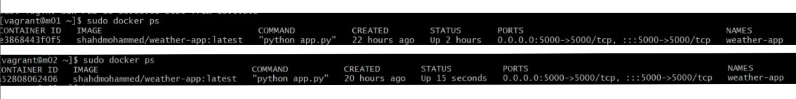
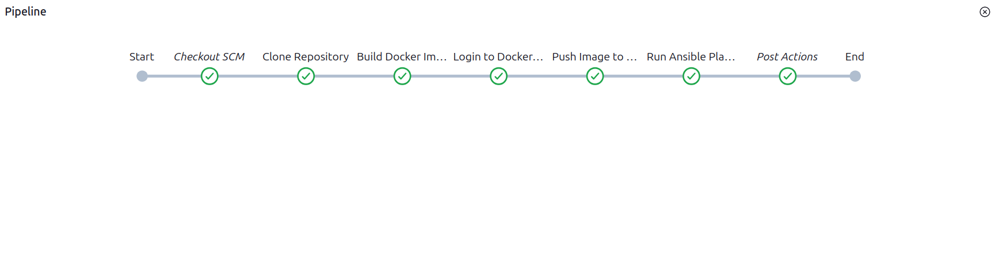
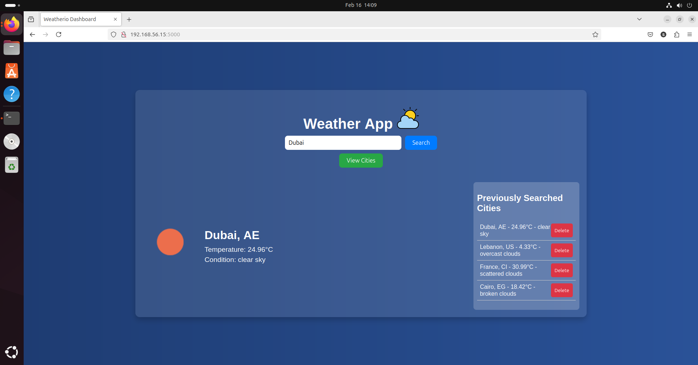
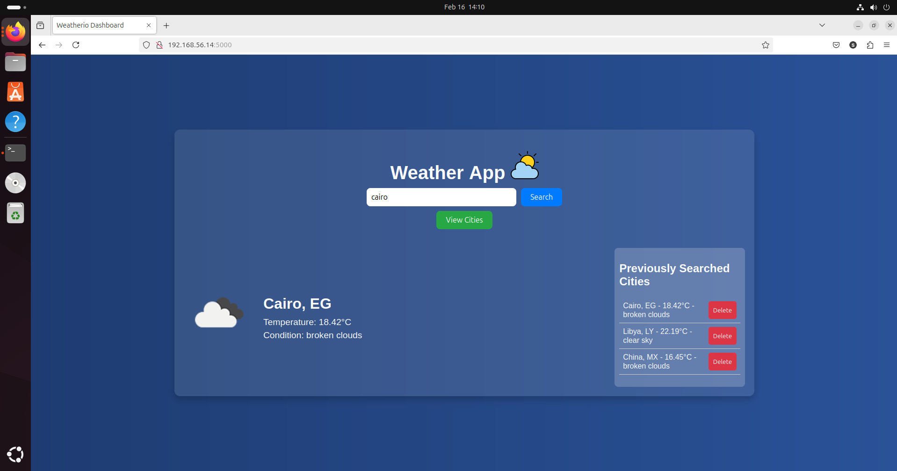

# 🌤 Weather App (Dockerized & Automated with Jenkins)

This is a simple *Flask-based weather application, containerized using **Docker* and deployed using *Jenkins*. The app fetches weather data and displays it in a user-friendly UI.

## 🚀 Features
- Displays real-time weather information.
- Built with *Flask (Python)*.
- *Dockerized* for easy deployment.
- *Automated Deployment* using *Jenkins Pipeline*.
- Runs on *two CentOS machines* using *Ansible*.
- Exposed on *port 5000*.

## 📸 Screenshots
| Docker Status | Jenkins Pipeline Success | Browser Access 1 | Browser Access 2 |
|--------------|-------------------------|------------------|------------------|
|  |  |  |  |


---

## 🛠 Setup & Installation

### *1️⃣ Prerequisites*
Ensure you have the following installed:
- *Jenkins* (with Docker & Ansible integration)
- Docker  
- Python (if running locally)  
- Git (optional)

### *2️⃣ Clone the Repository*
```sh
git clone https://github.com/shahdmohd/weather-app.git
cd weather-app
```
### *3️⃣ Jenkins Pipeline Execution*

1. Open Jenkins and navigate to your pipeline.
2. Run the pipeline to install Docker on two CentOS machines and deploy the application.
3. Verify that the pipeline completes successfully.

### **5️⃣ Access the Application**

Once the container is running, access the app via:

```
http://<your-ip>:5000
```

Replace `<your-ip>` with the appropriate IP address.

---

## 🔧 Troubleshooting

- **If the pipeline fails**, check the Jenkins logs.
- **If the container does not start**, use:
  ```sh
  docker ps -a
  ```
  to inspect logs.
- Ensure **port 5000** is open and accessible.
